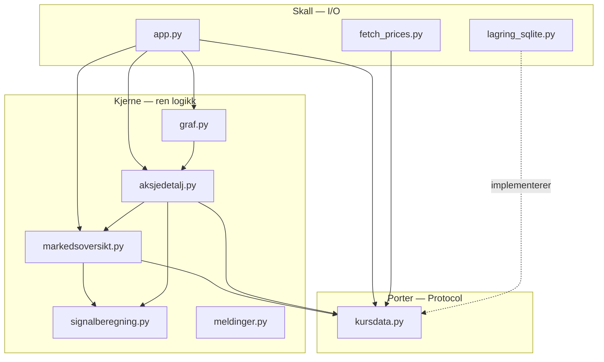
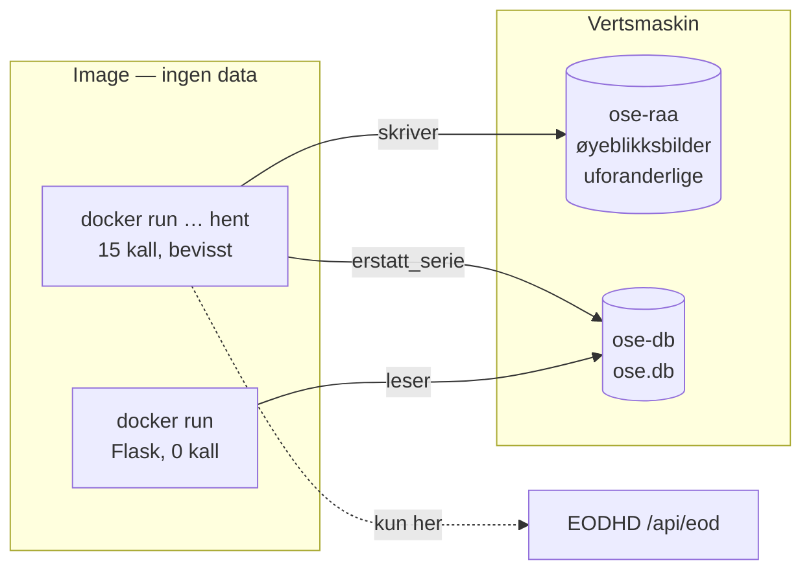
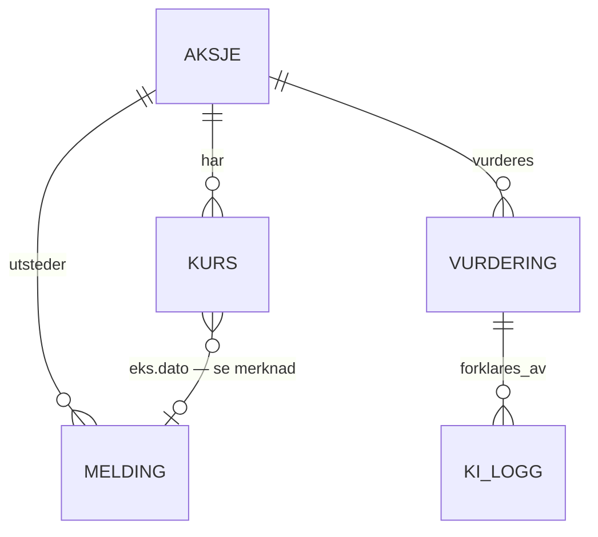

# Architecture Spine — OSE Signal

## Design Paradigm

**Funksjonell kjerne, imperativt skall.** All regning er rene funksjoner uten
I/O; alt som rører nett, disk eller HTTP ligger i skallet. Lagring nås bare
gjennom porter — `typing.Protocol` — slik at kjernen aldri vet om en serie kom
fra en fil, en database eller en test.

Paradigmet er ikke valgt her. Det ble bygget 20.–21.09 og står ordrett i hver
kjernemodul sin docstring: *«Ren logikk. Ingen API-kall, ingen filer, ingen
HTML.»* Spinen navngir det og gjør det bindende.

| Lag | Filer | Regel |
|---|---|---|
| **Kjerne** | `signalberegning.py`, `meldinger.py`, `markedsoversikt.py`, `aksjedetalj.py`, `graf.py` | Ingen import av `requests`, `sqlite3`, `pathlib`, `flask` |
| **Porter** | `kursdata.py` | Bare `Protocol`-definisjoner og verdityper |
| **Skall** | `app.py` (HTTP), `fetch_prices.py` (nett), lagringsadapteren (SQLite) | Eneste lag som kjenner teknologi |

**`kursdata.py` oppfyller ikke portregelen i dag, og det skal stå her til den
gjør det.** Fila importerer `json` og `pathlib`; `SnapshotKilde.fra_fil` leser
fil og `nyeste_snapshot` globber katalogen. `app.py` kaller `nyeste_snapshot()`
direkte, altså utenom enhver port. Utskillingen til `lagring_sqlite.py` og
`lagring_fil.py` er en **gjenstående endring**, ikke en beskrivelse av dagens
kode.

## Invariants & Rules

Avhengighetsretningen — hvem som **får** avhenge av hvem. En pil som peker
motsatt vei er et brudd, ikke en stilsak:



`signalberegning.py`, `meldinger.py` og `kursdata.py` importerer ingen annen
prosjektmodul. De er løvnoder, og skal forbli det.

### AD-1 — Kjernen gjør ingen I/O `[ADOPTED 2026-09-20/21]`

- **Binds:** all kode under «Kjerne»
- **Prevents:** at en beregning begynner å lese en fil eller kalle et endepunkt, slik at den ikke lenger kan testes uten nett eller kvote
- **Rule:** kjernemoduler importerer ikke `requests`, `sqlite3`, `pathlib` eller `flask`. Data kommer inn som argumenter eller gjennom en port.
- **Opphav:** commit `01af1a5` (20.09), `9acb55c` (20.09), `706720f`, `076bb12`, `b6ba9d8` (21.09)

### AD-2 — Nøyaktig én funksjon rører nettet `[ADOPTED 2026-09-21]`

- **Binds:** FR-401, FR-403, FR-404, hele kvotehåndteringen
- **Prevents:** at to moduler hver for seg begynner å kalle EODHD, og at en kvote på 20 kall brennes uten at noen ser hvor
- **Rule:** nettkall skjer **bare i skallet**, med **én hentefunksjon per kilde**, og funksjonen injiseres til den som bruker den — slik `hent_universet(..., hent=hent_ett_symbol)` allerede gjør. I dag er EODHD eneste kilde; FR-404 (NewsWeb) og FR-301 (finanskalenderen) får hver sin, i hver sin skallfil.
- **Opphav:** commit `352e3a2` (21.09). *Regelen er omformulert i gjennomgangen: «eneste sted `requests` brukes» kunne ikke overleve FR-404 og FR-301, og ville blitt stilltiende brutt.*

### AD-3 — Én port per eid datasett

- **Binds:** FR-406, FR-408, FR-501..FR-503, FR-604, FR-605
- **Prevents:** at to moduler bygger hver sin skrivesti til samme tabell, og at en test må stille opp hele lagringen for å bytte ut ett lager
- **Rule:** hvert datasett har nøyaktig **én** port og nøyaktig **én** skriver. Lesere går gjennom porten. Portene er `Kurslager`, `Meldingskilde`, `Vurderingslager` og `KILogg` — ikke én felles lagerklasse.
- **Opphav:** mønsteret er utvidet, ikke oppfunnet. `Kurskilde` i `kursdata.py`, commit `be2ba93` (21.09)

### AD-4 — SQLite er motoren

- **Binds:** FR-407, FR-408, FR-604, FR-605
- **Prevents:** at lagringsvalget drar inn en tjeneste som bryter vilkårene, eller en oppstartsrekkefølge som kan feile under demonstrasjonen
- **Rule:** `sqlite3` fra standardbiblioteket. Basefila ligger under `data/`, som er gitignorert. Ingen hostet database — EODHDs godkjenning krever at *«the output stays local»*, og Euronext forbyr å *«otherwise transfer any of the Content to any third person»*.
- **Omgjøres av:** flere samtidige skrivere, eller at applikasjonen flytter av én maskin. Ingen av delene er i v1. Skjer det, **byttes motoren — ikke designet**; det er nettopp derfor AD-3 ligger der den ligger.

### AD-5 — Serien skjøtes aldri på

- **Binds:** FR-406
- **Prevents:** at `adjusted_close` blir inkonsistent. EODHD regner serien om bakover ved hvert nytt utbytte, så en påskjøtet serie blander to justeringsgrunnlag
- **Rule:** `Kurslager.erstatt_serie(symbol, rader)` sletter symbolets rader og setter inn de nye i **én transaksjon**. Det finnes ingen `legg_til_rad`. Hver henting dekker minst 175 handelsdager; i praksis et helt år, fordi ett kall koster likt uansett intervallengde.

### AD-6 — Rådata er uforanderlige filer, ikke rader

- **Binds:** NFR-07, FR-406
- **Prevents:** at dokumentasjonen som skal etterprøves om ti år, bare kan leses gjennom applikasjonen som produserte den
- **Rule:** hvert uttrekk skrives som `<prefiks>-raa-<ÅÅÅÅ-MM-DD>.json` og skrives **aldri** om. Filene går ikke inn i databasen. Velgeren `nyeste_snapshot` lar datoen avgjøre alene; ved lik dato vinner `KURSPREFIKS`.

### AD-7 — Uerstattelige lagre har ingen slette- eller endremetode

- **Binds:** FR-408, FR-604, FR-605
- **Prevents:** at historikken over *hva løsningen mente* går tapt eller skrives om. Den kan ikke regnes ut på nytt: en omregning gir dagens parametres svar, ikke datidens — og da er FR-408s eget spørsmål, «hva sa løsningen om EQNR for to uker siden?», ubesvarlig
- **Rule:** `Vurderingslager` og `KILogg` har **bare** `skriv` og lesemetoder. Ingen `slett`, ingen `endre`. **Fraværet er invarianten.** Mønsteret er utvidet, ikke oppfunnet: `SnapshotKilde` har allerede «med vilje ingen skrivemetode».
- **Skjerpet:** fraværet alene holder ikke, fordi AD-17 krever at `skriv` er idempotent på `(symbol, dato)` — og en upsert *endrer* raden hvis den finnes. Derfor bærer **formen** regelen: `skriv` tar imot datoen og **avviser enhver dato som ikke er inneværende børsdag**. Dagens rad kan skrives om så mange ganger man vil; en eldre rad er utilgjengelig gjennom porten. Ingen behøver å huske forskjellen. Dette er en skjerping av AD-7, ikke et unntak fra den.
- **Merk:** skillet mellom gjenoppbyggbart og uerstattelig går **tvers gjennom databasen**, ikke mellom base og fil. `kurs` er gjenoppbyggbar; `vurdering` og `ki_logg` er det ikke.

### AD-8 — Nettverk er sperret i testkjøringen `[ADOPTED 2026-09-21]`

- **Binds:** alle tester; åpent punkt 14
- **Prevents:** at en test ved et uhell spiser en dags kvote — og i CI ville gjort det på hver eneste push
- **Rule:** `tests/conftest.py` monkeypatcher `socket.connect` og `connect_ex` med en autouse-fixture; bare loopback slipper gjennom. **Hver story leveres med test, og testen kjører uten nett.** CI kjører `pytest` på hver push og PR, uten hemmeligheter.
- **Opphav:** commit `266e6d9` (21.09). Prøvd: 166 tester grønne 2026-09-22

### AD-9 — Imaget inneholder aldri data

- **Binds:** punkt 18, leveransen
- **Prevents:** videreformidling av kilde­data. EODHDs godkjenning av 21.09 dekker **demonstrasjonen** for lærer og klasse — den dekker ikke at vi overleverer et datasett
- **Rule:** imaget bygges fra repoet, og repoet har ingen rådata (`.gitignore` utelater `data/` og `*-raa-*.json`). Et seedet datasett bakes **ikke** inn «for at det skal virke hos sensor». Leveransen er Dockerfile og kildekode, ikke et ferdig image.

### AD-10 — Webserveren starter aldri en henting

- **Binds:** FR-401 *(konflikt — se Deferred)*
- **Prevents:** at kvoten brennes av at noen starter containeren. En container startes på nytt hver gang, så «ved oppstart» betyr noe helt annet i Docker enn i en applikasjon som starter én gang. To `docker run` samme dag = 30 kall mot en grense på 20
- **Rule:** `docker run` starter Flask og koster **null** API-kall, alltid. Er basen tom, vises tom-tilstand med melding om hvordan man henter. Henting er en egen kommando mot samme image, altså en bevisst handling og ikke en bivirkning av at noe startet.

### AD-11 — To volumer

- **Binds:** NFR-07, punkt 18
- **Prevents:** at ett `docker volume rm` tar rådataøyeblikksbildene sammen med en base som skulle vært engangs
- **Rule:** `ose-db` for basefila, `ose-raa` for øyeblikksbildene. Rådata er beskyttet uansett hva som skjer med basen. **Men «du kan slette basen» er feil råd** — se AD-7.

### AD-12 — Hemmeligheter kommer fra miljøet

- **Binds:** AD-9, FR-401
- **Prevents:** en API-nøkkel i et image eller i git
- **Rule:** `EODHD_API_KEY` leses fra miljøet ved kjøretid. `.env` er gitignorert, `.env.example` viser bare variabelnavnet, og CI kjører med `permissions: contents: read` og ingen hemmeligheter.

### AD-13 — Signalparametre er konstanter med måling bak seg `[ADOPTED 2026-09-20/21]`

- **Binds:** FR-701..FR-705
- **Prevents:** at en parameter justeres til den gir et penere bilde. Modellen skal beskrive hva som skjedde, ikke forutsi hva som skjer
- **Rule:** `TERSKEL=2`, `VOLUMFAKTOR=1.5`, `NOYTRALSONE=0.02` er låst mot 199 handelsdager og 2 985 aksjedager. Hver konstant bærer målingen i kommentaren ved siden av seg. En endring krever ny måling ført i `malinger.md`, ikke en begrunnelse i en commit-melding.
- **Uprøvd:** `VOLATILITET_VINDU=20` og `VOLUM_VINDU=20` er merket `[FORELØPIG]` og er **ikke** målt.

### AD-14 — Deduplisering før kategorifilter `[ADOPTED 2026-09-20]`

- **Binds:** FR-501, FR-502
- **Prevents:** at dubletter som passerer filteret telles to ganger
- **Rule:** rekkefølgen er bindende og står i `meldinger.py` sin docstring. Commit `9acb55c` (20.09)

### AD-15 — En aksje som mangler data stopper ikke hovedflyten `[ADOPTED 2026-09-21]`

- **Binds:** NFR-03, FR-402, FR-403
- **Prevents:** at én feilende ticker gjør hele oversikten tom
- **Rule:** henting og visning fortsetter for de øvrige symbolene; de som mangler føres i `feil` og navngis for brukeren. Et symbol som feiler får **ingen ny sjanse** — det ville kostet et kall til.

### AD-16 — Skjemaendringer skjer med nummererte migrasjoner

- **Binds:** AD-7, alle tabeller
- **Prevents:** at vi to endrer skjemaet hver vår vei, og at en skjemaendring løses med «slett basen og bygg den på nytt» — noe AD-7 gjør umulig for `vurdering` og `ki_logg`
- **Rule:** migrasjoner er nummererte SQL-filer som kjøres i rekkefølge; anvendt versjon står i en `skjema_versjon`-tabell. Ingen `ALTER TABLE` utenfor en migrasjonsfil.
- **Merk:** dette er en **ny** beslutning, ikke ADOPTED. Den følger av AD-7, men ingen kode viser den ennå.
- **To SQLite-forhold migrasjonene må ta hensyn til, begge verifisert:** `executescript()` kjører en implisitt `COMMIT` først, så den nærliggende måten å kjøre en `.sql`-fil på er **ikke** atomisk med oppdateringen av `skjema_versjon` — migrasjonsløperen må styre transaksjonen selv. Og SQLites `ALTER TABLE` dekker bare rename/add/drop column; typeendring, `UNIQUE`, `CHECK` og fremmednøkler krever tabellbytte med `DROP TABLE`. **For `vurdering` og `ki_logg` kolliderer det med AD-7** — se åpent punkt under.

### AD-17 — Hentekommandoen skriver dagens vurdering

- **Binds:** FR-408, AD-7, AD-10
- **Prevents:** at ingen er utpekt til å fylle `vurdering`, slik at AD-7 ender med å verne en tom tabell
- **Rule:** `docker run … hent` henter kursene, kaller `erstatt_serie`, og regner deretter ut og skriver dagens vurdering for alle femten **i samme kjøring**. Én utløser, ett tidspunkt. `skriv` er idempotent på `(symbol, dato)`.
- **Forkastet:** lat skriving ved sidevisning — en dag ingen åpner siden, blir aldri lagret, og FR-408 forutsetter at dagen finnes selv om ingen så på den. Egen tredje kommando — den kan glemmes, og kravet sier *automatisk*.

### AD-18 — Vurderingen kopierer kursen, uten fremmednøkkel

- **Binds:** FR-408, AD-5, AD-7
- **Prevents:** at `erstatt_serie` river grunnen under historikken. Med `RESTRICT` ville hver henting fra dag to feilet for alle femten; med `CASCADE` ville historikk blitt slettet uten at noen kalte `slett`, altså AD-7 omgått på SQL-nivå av en AD-5-lydig handling
- **Rule:** `vurdering` lagrer `close` og `adjusted_close` som **verdier**, ikke som peker. Ingen fremmednøkkel fra `vurdering` til `kurs`.
- **Merk:** fraværet av fremmednøkkel er ikke en forenkling — det **følger av kravet**. FR-408 ber om et øyeblikksbilde, og et øyeblikksbilde som peker på en rad som endres, er ikke et øyeblikksbilde. At lagret kurs og dagens omregnede kurs spriker etter et utbytte, er to forskjellige spørsmål, og begge svarene skal kunne leses.

### AD-19 — Porten returnerer en typet norsk rad

- **Binds:** alle konsumenter av `Kurslager`
- **Prevents:** at EODHDs engelske nøkler blir en udokumentert kontrakt. En feilstavet nøkkel i en `dict` gir `None` i stedet for en feil, og `None` forplanter seg inn i signalberegningen som et tall som *mangler* — ikke som noe som stopper
- **Rule:** porten returnerer `list[Kursrad]` med `dato`, `slutt`, `justert_slutt`, `volum`. Adapteren oversetter fra kildens feltnavn. En ny kilde skal ikke måtte etterligne EODHD for å passe inn.
- **Når:** innføres i **samme endring** som SQLite-adapteren, ikke som egen runde — adapteren må uansett røre dette laget. Rekkefølge: (1) `Kursrad` defineres, (2) protokollen, `SnapshotKilde` og SQLite-adapteren oppdateres i samme omgang, (3) konsumentene. **Testene kjøres i sin helhet mellom hvert steg**, ikke bare til slutt.

### AD-20 — Børsdager i Europe/Oslo, tidsstempler i UTC

- **Binds:** FR-401, FR-402, FR-406, FR-408, AD-6
- **Prevents:** at tid leses som tekst uten at noen vet hvilken sone teksten er i. Det er to steder i koden i dag, samme feilklasse: `fetch_prices.main` navngir fila med `date.today()` og stempler innholdet med `datetime.now(timezone.utc)`, så mellom midnatt og 02:00 norsk tid peker de på hver sin dag; og `meldinger._minutt` returnerer `tidspunkt[:16]` uten å gå via et tidsobjekt. Det siste er verst fordi det er **stille** — `[:16]` gir alltid en streng, så to representasjoner av samme øyeblikk blir to ulike dublettnøkler og FR-501 slutter å deduplisere uten at noe feiler
- **Rule:** hvilken dag en sluttkurs tilhører, avgjøres av **norsk kalenderdato** — det er Oslo Børs dataene kommer fra. Tidsstempler for *når* noe ble hentet, forblir **UTC med offset**, så de kan sammenliknes på tvers av sommertid. Filnavn og `hentet` utledes av **samme øyeblikk**.
- **Forkastet:** alt i UTC. «Dagens sluttkurs» ville fått feil dag for alle hentinger mellom midnatt og 02:00, og FR-402 ville bommet i samme vindu. Det er ikke færre omregninger, bare en omregning flyttet dit den ikke synes.

## Consistency Conventions

| Hensyn | Konvensjon |
|---|---|
| Navn | Norsk i kode og kommentarer, som i resten av prosjektet. Porter navngis `<Datasett>lager` (skriver) eller `<Datasett>kilde` (leser) |
| Symbol mot ticker | `symbol` er NewsWeb-formen (`EQNR`), `ticker` er EODHD-formen (`EQNR.OL`). De blandes aldri; `Aksje` er raden som binder dem |
| Datoer | `YYYY-MM-DD` som tekst. En børsdato er en **norsk** kalenderdato (AD-20); et tidsstempel er ISO 8601 med UTC-offset. Datoen i et filnavn er dataenes dag — aldri filens mtime |
| Kursrader | `Kursrad` med norske felt (AD-19). Kildens feltnavn stopper i adapteren |
| Kurs | Beregning bruker `adjusted_close` (FR-701). Markedsoversikten viser `close`. Forskjellen er tilsiktet og dokumentert |
| Feil | En manglende aksje er en rad i `feil`, ikke et unntak som bobler opp (AD-15) |
| Tester | Hver story leveres med test. Testen kjører uten nett (AD-8). Kjerne testes direkte; skall testes med port-dobler som `MinneKilde` |
| Konfigurasjon | Fra miljøet, aldri fra kode eller image (AD-12) |

## Stack

Seed — sannhet ved kaldstart, eid av koden når den finnes. Venstre kolonne er
**faktisk låst versjon** fra `uv.lock`; gulvet fra `pyproject.toml` står i
parentes. Skillet er ikke pedantisk: pytest kjører på **9.1.1** mens gulvet sier
`>= 8.0`, altså et helt hovedversjonssteg ingen har besluttet.

| Navn | Versjon |
|---|---|
| Python | 3.13 (`requires-python = ">=3.13"`, CI pinner 3.13) |
| Flask | 3.1.3 (gulv `>= 3.0`) |
| requests | 2.34.2 (gulv `>= 2.32`) |
| python-dotenv | 1.2.3 (gulv `>= 1.0`) |
| pytest | **9.1.1** (gulv `>= 8.0`) |
| sqlite3 | standardbiblioteket — ingen ny avhengighet |
| uv | `uv.lock`, CI kjører `uv sync --locked` |

Ingen frontend-avhengighet: grafen er en SVG-polyline som malen setter tall
inn i.

## Structural Seed

Kjøring og volumer:



Kjerneentiteter:



`kurs` er gjenoppbyggbar. `vurdering` og `ki_logg` er det ikke (AD-7).

**Utbyttemerkingen (FR-407) er ikke låst til NewsWeb.** Kravet sier selv at
«datakilden er ikke lenger avhengig av NewsWeb — justeringsdagen kan leses ut av
kursserien alene», målt 21.09 til 38 hendelser over 3 720 dagovergangner. Joinen
mot `melding` er derfor en *mulig* kilde, ikke den bindende. Valget ligger i
åpent punkt 4 og skal tas der, ikke her.

```text
G74-lund-osen/
  src/
    kursdata.py          # porter + AKSJEUNIVERS. Ingen I/O
    lagring_sqlite.py    # adapter: implementerer portene   [ny]
    migrasjoner/         # nummererte SQL-filer (AD-16)     [ny]
    fetch_prices.py      # eneste nettkall
    signalberegning.py   # ren logikk
    meldinger.py         # ren logikk
    markedsoversikt.py   # ren logikk
    aksjedetalj.py       # ren logikk
    graf.py              # ren regning
    app.py               # HTTP og HTML
  data/                  # gitignorert — to volumer i Docker
    raa/                 # uforanderlige øyeblikksbilder      [flyttes hit]
    db/ose.db            #                                    [ny]
  tests/                 # conftest.py sperrer nett
  Dockerfile             # [ny]
```

## Capability → Architecture Map

| Område | Ligger i | Styres av |
|---|---|---|
| Markedsoversikt (FR-101..103) | `markedsoversikt.py` | AD-1, AD-3 |
| Aksjedetalj og graf (FR-201..204) | `aksjedetalj.py`, `graf.py` | AD-1, AD-3 |
| Henting og kvote (FR-401..405) | `fetch_prices.py` | AD-2, AD-5, AD-10, AD-15 |
| To lagre (FR-406) | `lagring_sqlite.py`, `data/raa/` | AD-5, AD-6, AD-11 |
| Dagens vurdering (FR-408) | `Vurderingslager`, skrevet av hentekommandoen | AD-3, AD-7, AD-16, AD-17, AD-18 |
| Meldingsfilter (FR-501..503) | `meldinger.py` | AD-1, AD-14 |
| Utbyttemerking (FR-407) | *ikke plassert* | AD-4 — **kilde ikke valgt**, se åpent punkt 4 |
| Kommende hendelser (FR-301..303) | *finnes ikke* | **Ingen** — se Deferred |
| KI-logg (FR-604..606) | `KILogg` | AD-3, AD-7 — *resten utsatt* |
| Signalet (FR-701..706) | `signalberegning.py` | AD-1, AD-13 |
| Leveransen | `Dockerfile` | AD-9, AD-10, AD-11, AD-12 |

## Deferred

| Utsatt | Hvorfor det kan vente |
|---|---|
| **FR-401 må skrives om** | AD-10 motsier kravets første setning. Spinen skal ikke stilltiende overstyre PRD-en — endringen gjøres i `prd.md`, ikke her |
| **Nøyaktig Docker-baseimage** | Må verifiseres mot gjeldende tagger når Dockerfilen skrives. Bindingen er at Python-versjonen matcher CI (3.13), ikke en bestemt tag |
| **KI-laget (FR-601..606)** | Modelltjeneste er ikke valgt, og betingelse 4 i EODHDs godkjenning — at tjenesten ikke trener på innholdet — er udokumentert. Den må føres **før** artikkeltekst sendes inn |
| **Kilde for handelskalenderen** | Åpent punkt 3. FR-402 hviler på «forventet børsdag», men ingen kilde er utpekt |
| **De to `[FORELØPIG]`-vinduene** | Åpent punkt; utgjør punkt 4 i utgangsbetingelsen for PRD-ens draft-status |
| **NewsWeb-hentingen** | Åpent punkt 1. Euronext forbyr automatisert henting uten tillatelse; forespørselen er ubesvart. Arkitekturen låser seg derfor **ikke** til at meldingsdelen finnes |
| **Om SQLite godtas** | Sendt faglærer 22.09, ubesvart. Kommer et nei, byttes motoren — ikke designet |
| **FR-301..303, kommende hendelser** | Hele PRD §4.3 var taus i første utkast av denne spinen. Det er en **tredje nettkilde** (Euronexts finanskalender) og et eid datasett uten port. `app.py` sier selv at «kommende hendelser mangler med vilje» — de ligger bak åpent punkt 1 og 16. Får sin port og sin AD når kilden er avklart, og **ikke før** |
| **Hvem kjører migrasjonene, og når** | AD-16 sier at de finnes, ikke hvem som anvender dem. Med to `docker run`-varianter (AD-10) er både web, henting og en tredje kommando forsvarlige svar. Avgjøres når Dockerfilen skrives |
| **Kjøremåte i containeren** | `app.py` har ingen WSGI-oppføring, og de flate importene virker i dag bare via `pythonpath = ["src"]` i pytest-konfigurasjonen. Begge må løses i Dockerfile-storyen |
| **Skjemaendring på et uerstattelig lager** | SQLite krever `DROP TABLE` for de fleste formendringer. AD-7 forbyr sletting gjennom porten, men sier ikke om en migrasjon er unntatt. Må avgjøres før første migrasjon som rører `vurdering` |
