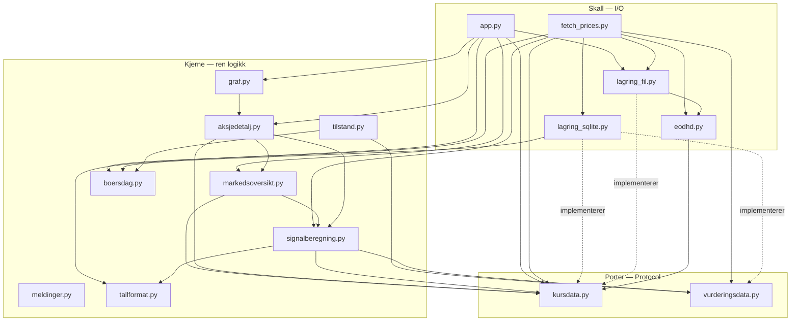
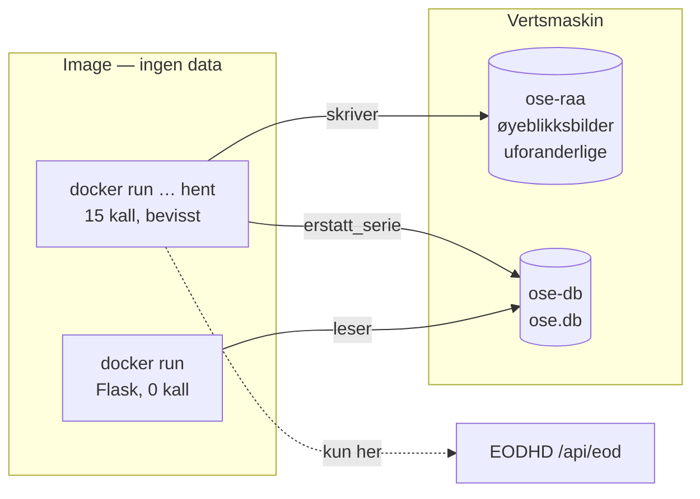
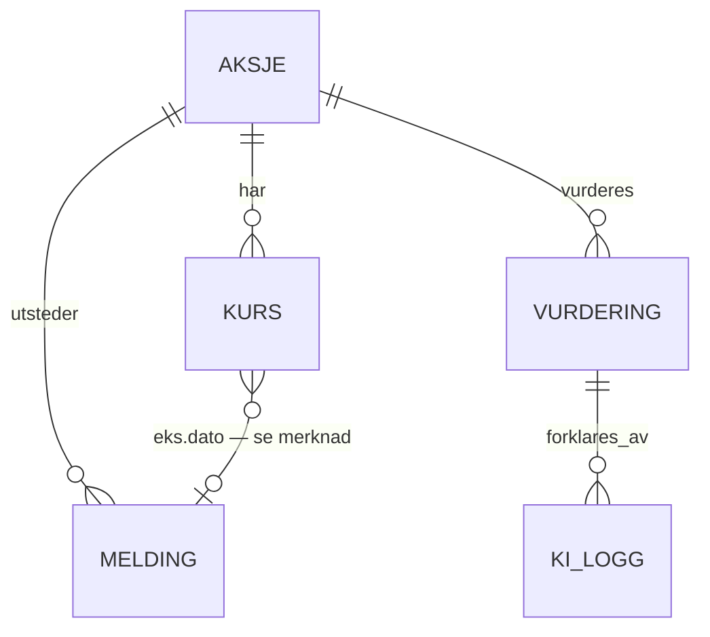

# Architecture Spine — OSE Signal

## Design Paradigm

**Funksjonell kjerne, imperativt skall.** All regning er rene funksjoner uten
I/O; alt som rører nett, disk eller HTTP ligger i skallet. Lagring nås bare
gjennom porter — `typing.Protocol` — slik at kjernen aldri vet om en serie kom
fra en fil, en database eller en test.

Paradigmet er ikke valgt her. Det ble bygget 20.–21.09 og står i hver
kjernemodul sin docstring, med ulik ordlyd. Fire av fem åpner med «Ren logikk»
(`signalberegning.py`, `meldinger.py`, `markedsoversikt.py`, `aksjedetalj.py`),
mens `graf.py` åpner med «Ren regning». Bare `aksjedetalj.py` har setningen
*«Ren logikk. Ingen API-kall, ingen filer, ingen HTML.»* ordrett. Spinen navngir
mønsteret og gjør det bindende. *Lagt til 2026-09-27:* `boersdag.py` (story 1.6)
er den sjette kjernemodulen og har også «Ren logikk». `tilstand.py` (story 1.7)
er den sjuende, med samme åpning.

| Lag | Filer | Regel |
|---|---|---|
| **Kjerne** | `signalberegning.py`, `meldinger.py` (bygget og testet, men ikke brukt i v1 (plan B)), `markedsoversikt.py`, `aksjedetalj.py`, `graf.py`, `boersdag.py` (inneværende børsdag, story 1.6), `tilstand.py` (de tre tilstandene i FR-409 og raden med grunn fra punkt 24, altså fire utfall, story 1.7) | Ingen import av `requests`, `sqlite3`, `pathlib`, `flask` |
| **Porter** | `kursdata.py`, `vurderingsdata.py` | Protokoller, verdityper og minneimplementasjonene testene bruker (`MinneKurslager`). *Rettet 2026-09-25: `MinneKilde` ble fjernet i story 1.4c*. Ingen I/O — oppfylt fra story 1.5 (`23af8db`). *Rettet 2026-09-25: her sto «brytes i dag, se under»*. `Vurderingslager` (story 1.6) har med vilje **ikke** noe minnelager: reglene for overskriving (siste vinner, men en grunn aldri over en vurdering) skal stå ett sted, i adapterens upsert, og testene bruker SQLite i minnet (`sqlite3.connect(":memory:")`) |
| **Skall** | `app.py` (HTTP), `fetch_prices.py` (nett), `lagring_sqlite.py` (SQLite), `lagring_fil.py` (øyeblikksbildene i `data/`), `eodhd.py` (EODHDs feltnavn til `Kursrad`) | Eneste lag som kjenner teknologi |

**`kursdata.py` oppfyller portregelen fra story 1.5 (`23af8db`, 2026-09-25).**
Før det importerte fila `json` og `pathlib`; `SnapshotKilde.fra_fil` leste fil
og `nyeste_snapshot` globbet katalogen, og `app.py` kalte `nyeste_snapshot()`
direkte, utenom enhver port. Avsnittet sto her som et brudd til det var lukket.
Nå ligger lesingen av øyeblikksbildene i `lagring_fil.py`, oversettelsen fra
EODHDs feltnavn i `eodhd.py`, og `app.py` får en `Kursleser` fra
`lagring_fil.nyeste_leser`. En test feiler hvis `kursdata.py` importerer `json`,
`pathlib` eller en adapter (`tests/test_konsumentene.py`).

## Invariants & Rules

Avhengighetsretningen — hvem som **får** avhenge av hvem. En pil som peker
motsatt vei er et brudd, ikke en stilsak:


```mermaid
graph TD
    subgraph skall["Skall — I/O"]
        app["app.py"]
        fetch["fetch_prices.py"]
        sqlite["lagring_sqlite.py"]
        fil["lagring_fil.py"]
        eodhd["eodhd.py"]
    end
    subgraph porter["Porter — Protocol"]
        kursdata["kursdata.py"]
        vurdering["vurderingsdata.py"]
    end
    subgraph kjerne["Kjerne — ren logikk"]
        marked["markedsoversikt.py"]
        detalj["aksjedetalj.py"]
        graf["graf.py"]
        signal["signalberegning.py"]
        meld["meldinger.py"]
        boersdag["boersdag.py"]
        tilstand["tilstand.py"]
        tallformat["tallformat.py"]
    end

    app --> marked
    app --> detalj
    app --> graf
    app --> kursdata
    app --> fil
    app --> tallformat
    fetch --> kursdata
    fetch --> fil
    fetch --> eodhd
    fetch --> sqlite
    fetch --> boersdag
    fetch --> signal
    fetch --> vurdering
    sqlite -. implementerer .-> kursdata
    sqlite -. implementerer .-> vurdering
    sqlite --> boersdag
    tilstand --> boersdag
    tilstand --> vurdering
    fil -. implementerer .-> kursdata
    fil --> eodhd
    eodhd --> kursdata
    marked --> signal
    marked --> kursdata
    detalj --> signal
    detalj --> marked
    detalj --> kursdata
    graf --> detalj
    signal --> kursdata
    signal --> tallformat
    signal --> vurdering
```

`meldinger.py`, `kursdata.py`, `vurderingsdata.py`, `boersdag.py` og
`tallformat.py` importerer ingen annen prosjektmodul. De er løvnoder, og skal forbli det. *Lagt til
2026-09-27 (story 1.6):* `vurderingsdata.py` og `boersdag.py`. Porten
importerer ikke kjernen, så datokontrollen i `skriv` ligger i
`lagring_sqlite.py`, som bruker `boersdag.py`. `tests/test_konsumentene.py`
feiler hvis en port importerer en adapter eller en kjernemodul. *Lagt til
2026-09-27 (story 1.7):* `tilstand.py` importerer `boersdag` og porten
`vurderingsdata`, altså kjerne og port, aldri skallet.
`signalberegning.py` importerer `kursdata`,
for `Kursrad`, siden story 1.4b (`c5efd05`), og `tallformat` siden story 8.0.
*Rettet 2026-09-30:* her sto «importerer bare `kursdata`», og
`tallformat.py` sto ikke i lista over løvnoder. *Rettet 2026-09-26:* her sto at
også `signalberegning.py` ikke importerte noen annen prosjektmodul, og kanten
`signal --> kursdata` manglet i grafen.
*Lagt til 2026-09-30 (story 8.0):* `tallformat.py` formaterer tallene sidene
viser (regel 21) og importerer ingen annen modul. Den er en løvnode.
`signalberegning.py` importerer den for forklaringen, og `app.py` registrerer
den som filteret `tall` i malene.
*Lagt til 2026-10-02 (story 2.5):* `signalberegning.py` importerer porten
`vurderingsdata` for `vurder`, som gjør en serie om til `Vurdering` eller
`Grunn`, slik `tilstand.py` importerer porten. Av prosjektets moduler
importerer den bare `kursdata`, `tallformat` og `vurderingsdata`, og
`tests/test_konsumentene.py` låser det. `fetch_prices.py` importerer
`signalberegning` og `vurderingsdata`. *Rettet samme dag:* kantene
`fetch --> sqlite` (fra story 2.1b) og `fetch --> boersdag` (fra story 2.1)
manglet i grafen.

### AD-1 — Kjernen gjør ingen I/O `[ADOPTED 2026-09-20/21]`

- **Binds:** all kode under «Kjerne»
- **Prevents:** at en beregning begynner å lese en fil eller kalle et endepunkt, slik at den ikke lenger kan testes uten nett eller kvote
- **Rule:** kjernemoduler importerer ikke `requests`, `sqlite3`, `pathlib` eller `flask`. Data kommer inn som argumenter eller gjennom en port.
- **Opphav:** commit `01af1a5` (20.09), `9acb55c` (20.09), `706720f`, `076bb12`, `b6ba9d8` (21.09)

### AD-2 — Nøyaktig én funksjon rører nettet `[ADOPTED 2026-09-21]`

- **Binds:** FR-401, FR-403, FR-404, hele kvotehåndteringen
- **Prevents:** at to moduler hver for seg begynner å kalle EODHD, og at en kvote på 20 kall brennes uten at noen ser hvor
- **Rule:** nettkall skjer **bare i skallet**, med **én hentefunksjon per kilde**, og funksjonen injiseres til den som bruker den — slik `hent_universet(..., hent=hent_ett_symbol)` allerede gjør. I dag er EODHD eneste kilde; FR-404 (NewsWeb) og FR-301 (finanskalenderen) får hver sin, i hver sin skallfil. **Modelltjenesten er også en kilde** (Epic 4, og plan B i Epic 5B): én hentefunksjon, i skallet, injisert, og aldri kalt fra en test. *Lagt til 2026-09-24.*
- **Opphav:** commit `352e3a2` (21.09). *Regelen er omformulert i gjennomgangen: «eneste sted `requests` brukes» kunne ikke overleve FR-404 og FR-301, og ville blitt stilltiende brutt.*
- **Merknad 2026-10-05 (FR-608, story 10.2 og 10.7):** hver modelltjeneste er en egen kilde, med én hentefunksjon i sin egen skallfil: `ki_lokal.py` (Ollama), `ki_gemini.py`, `ki_anthropic.py` og `ki_openai.py`. Alle oppfyller porten `Modell`, og funksjonen injiseres. `OSE_KI_TJENESTE` velger én tjeneste per kjøring, uten stille overgang. Ingen av dem kalles fra en test (`AD-8`).

### AD-3 — Én port per eid datasett

- **Binds:** FR-406, FR-408, FR-501..FR-503, FR-604, FR-605
- **Prevents:** at to moduler bygger hver sin skrivesti til samme tabell, og at en test må stille opp hele lagringen for å bytte ut ett lager
- **Rule:** hvert datasett har nøyaktig **én** port og nøyaktig **én** skriver. Lesere går gjennom porten. Portene er `Kurslager`, `Meldingslager`, `Vurderingslager` og `KILogg` — ikke én felles lagerklasse. *Omdøpt 2026-09-24: `Meldingskilde` heter `Meldingslager` etter navneregelen, fordi porten har en skriver (story 6.1). Den er ikke bygget.*
- **Opphav:** mønsteret er utvidet, ikke oppfunnet. `Kurskilde` i `kursdata.py`, commit `be2ba93` (21.09)
- **Leseside, 2026-09-23:** `Kursleser` (`serie`, `sist_hentet`) er lesesiden av porten for kursdata, og `Kurslager` er `Kursleser` pluss `erstatt_serie`. Det er én port med en leseside, ikke to porter. `Kursleser` er `Kurskilde` født på nytt, med `Kursrad` og tid per symbol.
- **Bruddet er lukket, 2026-09-25:** fra story 1.2 (valg b) sto `Kurskilde` ved siden av `Kurslager`, altså to porter for kursdataene. Story 1.4c fjernet `Kurskilde`, `MinneKilde` og testen som holdt bruddet fra å vokse, commit `a91ef79`. Kursdataene har nå én port.
- **Føring 2026-09-30 (Min liste, story 8.3):** merkingen i Min liste blir et nytt datasett med egen port og webserveren som eneste skriver. Hentekommandoen og webserveren skriver da til samme basefil, men til hver sin tabell (AD-4). Navnet på porten settes når 8.3 bygges.
- **Merknad 2026-10-03 (story 2.2b, beslutning 1):** `Oversiktsleser` (`oversiktsdata.py`) er en port som bare leser, uten skriver. Den leser på tvers av datasettene, `aksje`, `kursserie`, `kurs` og `vurdering`, i én spørring med join, så sidene får én vei til tallet. Adapteren er `SqliteOversiktsleser` i `lagring_sqlite.py`, og `app.py` har ingen SQL. Hvert datasett har fortsatt én port med én skriver. Porten har bare `oversikt()` og `post(symbol)`, og en test krever at den ikke har noen skrivemetode. Dagens vurdering er raden for datoen til nyeste kurs, og sidene leser selskapene fra `aksje` (merknaden 03.10 under AD-21).

### AD-4 — SQLite er motoren

- **Binds:** FR-407, FR-408, FR-604, FR-605
- **Prevents:** at lagringsvalget drar inn en tjeneste som bryter vilkårene, eller en oppstartsrekkefølge som kan feile under demonstrasjonen
- **Rule:** `sqlite3` fra standardbiblioteket. Basefila ligger under `data/`, som er gitignorert. Ingen hostet database — EODHDs godkjenning krever at *«the output stays local»*, og Euronext forbyr å *«otherwise transfer any of the Content to any third person»*.
- **Omgjøres av:** flere samtidige skrivere, eller at applikasjonen flytter av én maskin. Ingen av delene er i v1. Skjer det, **byttes motoren — ikke designet**; det er nettopp derfor AD-3 ligger der den ligger.
- **Bekreftet 2026-09-22** av assisterende hjelpelærer: *«Slik dere beskriver bruken, strukturert lagring over tid, relasjoner mellom data, joins, migrasjoner og logging av KI-vurderinger, bruker dere SQLite som en ordentlig database, ikke bare som enkel fillagring. […] Så ut fra det vi vet nå mener jeg dette er helt innenfor.»* Svaret bærer to begrensninger som ikke skal skrives bort: det kom ikke fra emneansvarlig, og det sier *«ut fra det vi vet nå»*.

### AD-5 — Serien skjøtes aldri på

- **Binds:** FR-406
- **Prevents:** at `adjusted_close` blir inkonsistent. EODHD regner serien om bakover ved hvert nytt utbytte, så en påskjøtet serie blander to justeringsgrunnlag
- **Rule:** `Kurslager.erstatt_serie(symbol, rader, hentet)` sletter symbolets rader og setter inn de nye i **én transaksjon**, sammen med `hentet`, som `sist_hentet(symbol)` leser (UTC, per symbol). Tidspunktet er et argument og leses ikke av lagerets egen klokke, så basen og rådatafila fra samme henting bærer samme øyeblikk. Det finnes ingen `legg_til_rad`. Hver henting dekker minst 175 handelsdager; i praksis et helt år, fordi ett kall koster likt uansett intervallengde. **En tom serie avvises** (`ValueError`) og endrer ingenting. Ingen lovlig kaller sender tom liste, og en som slapp gjennom ville slettet symbolets historikk og satt et ferskt tidsstempel på ingenting — en feil som ser ut som suksess. Håndheves i `kursdata.kontroller_skriving` for begge lagrene og er prøvd med mutant, story 1.3 (`f4fada0`).

### AD-6 — Rådata er uforanderlige filer, ikke rader

- **Binds:** NFR-07, FR-406
- **Prevents:** at dokumentasjonen som skal etterprøves om ti år, bare kan leses gjennom applikasjonen som produserte den
- **Rule:** hvert uttrekk skrives som `<prefiks>-raa-<ÅÅÅÅ-MM-DD>.json` og skrives **aldri** om. Filene går ikke inn i databasen. Velgeren `nyeste_snapshot` lar datoen avgjøre alene; ved lik dato vinner `KURSPREFIKS`.

### AD-7 — Uerstattelige lagre har ingen slette- eller endremetode

- **Binds:** FR-408, FR-604, FR-605
- **Prevents:** at historikken over *hva løsningen mente* går tapt eller skrives om. Den kan ikke regnes ut på nytt: en omregning gir dagens parametres svar, ikke datidens — og da er FR-408s eget spørsmål, «hva sa løsningen om EQNR for to uker siden?», ubesvarlig
- **Rule:** `Vurderingslager` og `KILogg` har **bare** `skriv` og lesemetoder. Ingen `slett`, ingen `endre`. **Fraværet er invarianten.** Mønsteret er utvidet, ikke oppfunnet: `SnapshotKilde` har allerede «med vilje ingen skrivemetode».
- **Skjerpet:** fraværet alene holder ikke, fordi AD-17 krever at `skriv` er idempotent på `(symbol, dato)` — og en upsert *endrer* raden hvis den finnes. Derfor bærer **formen** regelen: `skriv` tar imot datoen og **avviser enhver dato som ikke er inneværende børsdag**. Dagens rad kan skrives om så mange ganger man vil; en eldre rad er utilgjengelig gjennom porten. Ingen behøver å huske forskjellen. Dette er en skjerping av AD-7, ikke et unntak fra den.
- **Utvidet 2026-09-27 (punkt 24 i PRD-en):** en rad kan ha en grunn i stedet for vurderingen. En rad med grunn skriver aldri over en rad med vurdering samme dag, så en kjøring som feiler, kan ikke viske ut et svar som alt er skrevet.
- **Bygget 2026-09-27, story 1.6:** `vurderingsdata.py` er porten, med bare `skriv` og `les`. `SqliteVurderingslager` tar en klokke, regner dagen i Europe/Oslo med `boersdag.norsk_dato` og avviser enhver annen dato enn `boersdag.innevaerende_boersdag`. `vurdering` lages av `0002_vurdering.sql` med en `CHECK` for enten vurdering eller grunn, og grunnene står i en egen tabell `grunn`. Hvert kontrollpunkt i storyen er prøvd med en mutant (spesifikasjonen, Implementation Notes).
- **Lest 2026-09-27, story 1.7:** `tilstand.tilstand(innhold, dato, idag)` tar imot det `les` gir og skiller svar, rad med grunn, ikke kjørt og ikke børsdag (FR-409), med `boersdag.er_boersdag` og samme liste som `skriv`. Porten fikk ingen ny metode. Ikke kjørt er ikke et endelig hull så lenge dagen er inneværende børsdag: raden kan skrives til neste børsdag begynner. En dato etter dagens dato reiser `ValueError`, også når raden finnes, og en dag uten rad utenfor `DEKKEDE_AAR` reiser `UtenforKalenderen`.
- **Målingene, avgjort av gruppen 2026-09-28** (skrevet inn 2026-09-29): en rad i `vurdering` lagrer også tallene de tre sjekkene ble avgjort av: `trend_avvik`, `dagens_endring`, `standardavvik` og `volumforhold`, uavrundet og som brøk (FR-408, story 2.1c). Et fortegn uten måling kan ikke etterprøves (FR-706), og målingene kan ikke fylles inn etterpå. Derfor må 2.1c være ferdig før den første ekte raden skrives. Ikke bygget ennå. *Rettet 2026-10-01:* bygget i story 2.1c, se linjen under.
- **Bygget 2026-10-01, story 2.1c:** `0004_maalinger.sql` legger `trend_avvik`, `dagens_endring`, `standardavvik` og `volumforhold` til `vurdering` med `ADD COLUMN` og en CHECK i hver kolonne, uten `DROP TABLE`. En rad med grunn har ingen måling, en vurdering har alle fire, bortsett fra at `volumforhold` kan mangle når interesse er 0, og `standardavvik` og `volumforhold` er aldri negative. Hjelpetabellen `kontroll_0004` stopper migrasjonen hvis det finnes vurderingsrader uten grunn, og løperen ruller den tilbake. `Sjekk` bærer `maaling` og `grense`, regelen for interesse avgjør med forholdstallet, og `Vurdering` kontrollerer de fire i porten (endelige tall, ikke negative der det gjelder, `None` bare ved interesse 0), men ikke fortegnet mot målingen. Kolonnene står i `VURDERINGSKOLONNER`. Omformingen fra `Signal` til `Vurdering` kommer i 2.5. Hvert kontrollpunkt er prøvd med en mutant (spesifikasjonen, Verification).
- **Merk:** skillet mellom gjenoppbyggbart og uerstattelig går **tvers gjennom databasen**, ikke mellom base og fil. `kurs` er gjenoppbyggbar; `vurdering` og `ki_logg` er det ikke.
- **Konsekvensen er tilsiktet:** en dag ingen kjørte hentekommandoen, kan ikke etterfylles med en vurdering. `FR-403` fyller hull i kursserien fordi en kurs for 12.09 er den samme uansett når den hentes; en vurdering er det ikke. Dagen skal kunne skilles som manglende, ikke som tom, i lageret — `FR-409`. *Rettet 2026-09-24: her sto «vises». FR-409 er et lagerkrav.*
- **Merknad 2026-10-03 (FR-411, demobasen, story 3.4):** AD-7 gjelder uendret for den ekte basen, og porten får ingen ny metode. Demokommandoen skriver én vurdering per aksje og dag gjennom `SqliteVurderingslager`, med lagerets klokke stilt på hver dag etter tur, så `skriv` brukes uendret og avviser fortsatt alle datoer utenom inneværende børsdag for den klokka. Demobasen er merket med `PRAGMA application_id`, med en fast verdi som bare demokommandoen setter. Det er trygt bare fordi demokommandoen nekter en base uten demomerket, og hentekommandoen nekter en demobase. Begge vaktene testes. Svikter en av dem, kan noen skrive historikk i ettertid i en ekte base. Hentekommandoen er fortsatt eneste skriver av kurser og vurderinger i den ekte basen (AD-3). Webserveren migrerer basen (story 2.2, AD-10), og Min liste får webserveren som skriver (føringen 2026-09-30 under AD-3).

### AD-8 — Nettverk er sperret i testkjøringen `[ADOPTED 2026-09-21]`

- **Binds:** alle tester; punkt 14, lukket 22.09 med denne beslutningen *(rettet 2026-09-26: her sto «åpent punkt 14»)*
- **Prevents:** at en test ved et uhell spiser en dags kvote — og i CI ville gjort det på hver eneste push
- **Rule:** `tests/conftest.py` monkeypatcher `socket.connect` og `connect_ex` med en autouse-fixture; bare loopback slipper gjennom. DNS er også sperret: `socket.getaddrinfo` avviser alle navn utenom loopback. Proxy er sperret: proxyvariablene fjernes, og `getproxies` i `requests` og `urllib` gir alltid `{}`, så en proxy på loopback ikke slipper en forespørsel ut (`982b216`, 23.09). **Hver story leveres med test, og testen kjører uten nett.** CI kjører `pytest` på hver push og PR, uten hemmeligheter.
- **Opphav:** commit `266e6d9` (21.09). Prøvd: 166 tester grønne 2026-09-22. DNS og proxy lagt til i `982b216` (23.09), hver sperre prøvd med en mutant. *Oppdatert 2026-09-24.*

### AD-9 — Imaget inneholder aldri data

- **Binds:** punkt 18, leveransen
- **Prevents:** videreformidling av kilde­data. EODHDs godkjenning av 21.09 dekker **demonstrasjonen** for lærer og klasse — den dekker ikke at vi overleverer et datasett
- **Rule:** imaget bygges fra repoet, og repoet har ingen rådata (`.gitignore` utelater `data/` og `*-raa-*.json`). Et seedet datasett bakes **ikke** inn «for at det skal virke hos sensor». Leveransen er Dockerfile og kildekode, ikke et ferdig image. *24.09: Dockerfilen er sagt av faglærer i samtale 21.09, ikke på emnesiden (hjelpelærer 23.09); den lages likevel.*
- **Utvidet 2026-10-03 (FR-411, Marians beslutning):** demobasen `data/db/demo.db` har oppdiktede selskaper og kurser, laget av en egen kommando uten nøkkel og uten nett. Oppdiktede tall er ikke data fra EODHD, så demobasen bryter ikke formålet med regelen, som er å ikke videreformidle kildedata. Imaget har likevel ingen base, heller ikke demobasen. Repoet har den heller ikke, fordi den ligger under `data/`, som er gitignorert. Den som vil prøve demoversjonen, kjører kommandoen selv.
- **Merknad 2026-10-05 (FR-608, story 3.1, 3.2 og 3.4):** den lokale modellen ligger i et eget volum, `ollama`, hentes første gang med Ollamas pull-endepunkt og er aldri i imaget. De ferdige KI-tekstene til demoen ligger i en fil i repoet, fordi demobasen aldri ligger der. Tekstene er laget av oppdiktede tall, ikke av data fra EODHD.
- **Merknad 2026-10-05, gruppens beslutning kl. 16:53:** den lokale modellen starter ikke av seg selv. Compose-fila i 3.1 starter appen uten Ollama, og Ollama med volumet `ollama` kommer inn som eget valg i story 10.2. KI-tekstene til demoen er story 3.4b.

### AD-10 — Webserveren starter aldri en henting

- **Binds:** FR-401, FR-408, FR-409
- **Prevents:** at kvoten brennes av at noen starter containeren. En container startes på nytt hver gang, så «ved oppstart» betyr noe helt annet i Docker enn i en applikasjon som starter én gang. To `docker run` samme dag = 30 kall mot en grense på 20
- **Rule:** `docker run` starter Flask og koster **null** API-kall, alltid. Er basen tom, vises tom-tilstand med melding om hvordan man henter. Henting er en egen kommando mot samme image, altså en bevisst handling og ikke en bivirkning av at noe startet.
- **Bygget 2026-10-03, story 2.2:** webserveren leser kursene fra basen gjennom `SqliteKurslager`. Bare de to rutene, `/` og `/aksje/<symbol>`, rører basen. Første forespørsel i en prosess mot en gitt `BASE_STI` kjører `migrer()` én gang, gjennom `aapne_base`, under en lås, så det virker likt med `python src/app.py`, `flask run` og en WSGI-server, og ingen import av `app` rører basen. Mangler basen, lager første forespørsel en tom base, slik hentingen gjør, så webserveren trenger skrivetilgang til `data/db/`. Hver forespørsel åpner sin egen tilkobling med `aapne_base(..., kjoer_migrasjoner=False)`, som bruker `mode=rw`, og lukker den i `teardown_appcontext`. Ventetiden på en lås er 5 sekunder (`VENTETID_SEKUNDER`). Kan basen ikke åpnes eller leses, svarer sidene 503 med feiltypen, uten stier. Den tomme siden viser kommandoen fra `HENTEKOMMANDO`, og en test krever den samme i README. `app.py` importerer verken `fetch_prices`, `requests`, `eodhd` eller `lagring_fil`, og en test viser null nettkall med tom base. Hvert kontrollpunkt er prøvd med en mutant (spesifikasjonen, Verification).

### AD-11 — To volumer

- **Binds:** NFR-07, punkt 18
- **Prevents:** at ett `docker volume rm` tar rådataøyeblikksbildene sammen med en base som skulle vært engangs
- **Rule:** `ose-db` for basefila, `ose-raa` for øyeblikksbildene. Rådata er beskyttet uansett hva som skjer med basen. **Men «du kan slette basen» er feil råd** — se AD-7.

### AD-12 — Hemmeligheter kommer fra miljøet

- **Binds:** AD-9, FR-401
- **Prevents:** en API-nøkkel i et image eller i git
- **Rule:** `EODHD_API_KEY` leses fra miljøet ved kjøretid. `.env` er gitignorert, `.env.example` viser bare variabelnavnet, og CI kjører med `permissions: contents: read` og ingen hemmeligheter.
- **Merknad 2026-10-05 (FR-608, story 10.7 og 10.8):** de nye variablene leses også fra miljøet: `OSE_KI_TJENESTE`, `OSE_KI_GEMINI_NOKKEL`, `OSE_KI_ANTHROPIC_NOKKEL` og `OSE_KI_OPENAI_NOKKEL`. `.env.example` viser bare navnene. Tokenfila for ChatGPT (10.8) ligger under `data/ki/`, som er gitignorert. Ingen nøkkel eller innlogging følger med appen eller repoet, og hver kobler bare til sin egen. Grunnen står i `docs/kilder-og-rettigheter.md`, «Betingelse 4 og KI-tjenestene (2026-10-04)»: avsnitt 4b i Google APIs Terms sier at «Developer credentials may not be embedded in open source projects.», og Agent SDK-oversikten sier at Anthropic ikke tillater tredjeparter å tilby claude.ai-innlogging. PRD-memloggen 04.10 nevner også avsnitt 2 i Anthropics Consumer Terms. Det er ikke sitert i `docs/kilder-og-rettigheter.md` og er ikke lest i økta 05.10, så det står ikke her.
- **Lagt til 2026-10-05, senere samme dag:** avsnitt 2 i Anthropics Consumer Terms er lest og sitert i `docs/kilder-og-rettigheter.md`, ved avsnittet om Claude-abonnementet: «You may not share your Account login information, Anthropic API key, or Account credentials with anyone else or make your Account available to anyone else.» (Consumer Terms, «Effective October 8, 2025»). Setningen er en grunn til regelen i denne merknaden, sammen med 4b i Google APIs Terms. Linjen over, som sier at avsnittet ikke er lest, står (regel 13).

### AD-13 — Signalparametre er konstanter med måling bak seg `[ADOPTED 2026-09-20/21]`

- **Binds:** FR-701..FR-705
- **Prevents:** at en parameter justeres til den gir et penere bilde. Modellen skal beskrive hva som skjedde, ikke forutsi hva som skjer
- **Rule:** `TERSKEL=2`, `VOLUMFAKTOR=1.5`, `NOYTRALSONE=0.02` er låst mot 199 handelsdager og 2 985 aksjedager. Hver konstant bærer målingen i kommentaren ved siden av seg. En endring krever ny måling ført i `malinger.md`, ikke en begrunnelse i en commit-melding.
- **Målt 2026-09-22** mot like mange aksjedager, 2 985, men ikke de samme: vinduet går til 21.09, mens §7.4 går til 18.09 — forskjøvet én handelsdag. `malinger.md` §9. Begge låst på 20. Målingen peker ikke ut 20 som et optimum — alt mellom 15 og 30 oppfører seg tilnærmet likt — men 20 ligger klar av det ustabile området under 15, der valget ville båret vekt det ikke kan forsvare.

### AD-14 — Deduplisering før kategorifilter `[ADOPTED 2026-09-20]`

- **Binds:** FR-501, FR-502
- **Prevents:** at dubletter som passerer filteret telles to ganger
- **Rule:** rekkefølgen er bindende og står i `meldinger.py` sin docstring. Commit `9acb55c` (20.09)

### AD-15 — En aksje som mangler data stopper ikke hovedflyten `[ADOPTED 2026-09-21]`

- **Binds:** NFR-03, FR-402, FR-403
- **Prevents:** at én feilende ticker gjør hele oversikten tom
- **Rule:** henting og visning fortsetter for de øvrige symbolene; de som mangler føres i `feil` og navngis for brukeren. Et symbol som feiler får **ingen ny sjanse** — det ville kostet et kall til.
- *Lagt til 2026-09-27 (story 1.8):* hentingen og leseren avgjør med samme funksjon, `eodhd.serie_fra_eodhd`, om en serie kan leses. En serie leseren avviser, føres i `feil` som «svar med feil form», og de andre lagres likevel. Før 1.8 hadde hentingen en svakere kontroll, og en slik serie ble lagret uten noe i `feil`, mens visningen droppet den (G1 i `kodegjennomgang-epic-1.md`). En test går gjennom `kjoer` og `nyeste_leser`: hver aksje kan leses eller står i `feil`.

### AD-16 — Skjemaendringer skjer med nummererte migrasjoner `[ADOPTED 2026-09-23]`

- **Binds:** AD-7, alle tabeller
- **Prevents:** at vi to endrer skjemaet hver vår vei, og at en skjemaendring løses med «slett basen og bygg den på nytt» — noe AD-7 gjør umulig for `vurdering` og `ki_logg`
- **Rule:** migrasjoner er nummererte SQL-filer som kjøres i rekkefølge; anvendt versjon står i en `skjema_versjon`-tabell. Ingen `ALTER TABLE` utenfor en migrasjonsfil.
- **Opphav:** besluttet her som ny beslutning, avledet av AD-7. Bygget i story 1.1, commit `57a83c5` (23.09): `src/migrering.py` er løperen, og `tests/test_migrering.py` har 21 tester. Hver migrasjon kjøres i én transaksjon sammen med sin rad i `skjema_versjon`. **Prøvd mot feilen den skal hindre:** med løperen midlertidig byttet til `executescript()` feilet 3 av 6 tester i `TestFeilMidtveis`. Det var skjemakontrollen som fanget det (tabellen `halvveis` ble stående), ikke versjonsraden, som mutanten lot være uendret. `src/migrasjoner/` finnes ikke ennå — første migrasjon kommer i story 1.3. *24.09: finnes nå, med `0001_kurs.sql` fra story 1.3 (`f4fada0`).* *26.09: løperen er herdet i story 1.5b (`ef1cca7`, PR #5).* `skjema_versjon` lagrer filnavn og sha256 av filteksten, og en anvendt migrasjon med nytt navn eller nytt innhold avvises. En `skjema_versjon` fra før 1.5b oppgraderes ikke stille. Hver migrasjon kjøres i sin egen `BEGIN IMMEDIATE`-transaksjon, og versjonen leses inne i den. En migrasjonsfil med en setning som begynner med et transaksjonsord (`BEGIN`, `COMMIT`, `END`, `ROLLBACK`, `SAVEPOINT`, `RELEASE`), avvises før noe kjøres. Katalogkontrollen er lik på Linux og Windows. SQLite-adapteren krever at basen står på siste versjon (`siste_versjon`), ikke bare at den er migrert én gang. Testene: 427 før og 455 etter. Mutanten `BEGIN IMMEDIATE` → `BEGIN` overlever, og en test med to migratorer som overlapper, er utsatt til story 3.1 (`deferred-work.md`).
- **Hvor `migrer()` kalles, avgjort 2026-09-28** (endringsforslaget): én funksjon åpner basen og kjører `migrer()` for både hentekommandoen og webserveren (story 2.1b og 2.2). Testen med to migratorer som overlapper, flyttes fra 3.1 til 2.1b. Se raden «Hvem kjører migrasjonene, og når» under Deferred.
- **Bygget 2026-09-29, story 2.1b:** `lagring_sqlite.aapne_base(sti)` lager mappa, kobler til og kjører `migrer()` mot `MIGRASJONSKATALOG`. Feiler migreringen, lukkes tilkoblingen, og feilen går videre. Ingen annen kode i `src/` kaller `sqlite3.connect`, og en vakt i `tests/test_konsumentene.py` holder det. Stiene er `lagring_fil.RAA_KATALOG` (`data/raa/`) og `lagring_sqlite.BASE_STI` (`data/db/ose.db`). Hentekommandoen bruker `aapne_base`; webserveren tar den i bruk i 2.2. Testen med to migratorer som overlapper, er på plass (`TestToMigratorerOverlapper` i `tests/test_migrering.py`): to tråder, hver med sin tilkobling, der den første holder transaksjonen åpen inne i migrasjonen til den andre har startet. Mutanten `BEGIN IMMEDIATE` → `BEGIN` feiler nå.
- **To SQLite-forhold migrasjonene må ta hensyn til, begge verifisert:** `executescript()` kjører en implisitt `COMMIT` først, så den nærliggende måten å kjøre en `.sql`-fil på er **ikke** atomisk med oppdateringen av `skjema_versjon` — migrasjonsløperen må styre transaksjonen selv. Og SQLites `ALTER TABLE` dekker bare rename/add/drop column; typeendring, `UNIQUE`, `CHECK` og fremmednøkler krever tabellbytte med `DROP TABLE`. **For `vurdering` og `ki_logg` kolliderer det med AD-7** — se åpent punkt under. *2026-09-27 (story 1.9):* `0003` legger koblingene til `aksje` med triggere, så ingen tabell bygges om (AD-21).

### AD-17 — Hentekommandoen skriver dagens vurdering

**Tatt opp igjen 2026-09-22.** Konklusjonen står, men på en annen grunn. Den
opprinnelige står bevart nederst i blokken.

- **Binds:** FR-408, FR-409, AD-5, AD-7, AD-10
- **Prevents:** at vurderingen regnes av en **annen serie** enn den som lå der da den ble skrevet
- **Rule:** `docker run … hent` henter kursene, kaller `erstatt_serie`, og regner deretter ut og skriver dagens vurdering for alle femten **i samme kjøring**. Én utløser, ett øyeblikk, ett par som hører sammen. `skriv` er idempotent på `(symbol, dato)`.
- **Bygget 2026-10-02, story 2.5:** `fetch_prices.kjoer` regner børsdagen én gang, `innevaerende_boersdag(norsk_dato(oeyeblikk))`, før filvakten og før første kall. Dekker ikke lista over stengte dager året, stopper kjøringen med 0 kall (NFR-08). Etter at alle seriene er skrevet, leser `skriv_vurderinger` dem tilbake med `SqliteKurslager.serie` og skriver én rad per aksje i universet med `SqliteVurderingslager`: `signalberegning.vurder` gir `Vurdering` med de fire målingene, eller `KURS_IKKE_FRA_DAGEN` eller `SIGNAL_IKKE_REGNET`, og et symbol som ikke ble skrevet, får `SYMBOL_FEILET`. En kjøring som fullfører, gir aldri en aksje uten rad. Feiler basen, skrives ingen vurdering, eller ingen flere. `main` gir `kjoer` klokka (`naa`); er det blitt en ny dag i Oslo før vurderingene, eller avviser `skriv` datoen midt i universet, stopper kjøringen og sier fra. En dag børsen er stengt, står en rad som finnes fra før. `--les-inn` skriver fortsatt aldri vurdering. Kjøringen fanger `sqlite3`-feil fra `SqliteVurderingslager.skriv` (G11). Hvert kontrollpunkt er prøvd med en mutant (spesifikasjonen, Verification).

**Begrunnelsen.** Vurderingen regnes av kursene som ble lagret i samme kjøring.
`AD-5` sier at `erstatt_serie` bytter ut **hele** symbolets serie ved hver
henting. Skrives vurderingen et annet sted eller på et annet tidspunkt, kan den
derfor regnes av et annet grunnlag enn det som lå der da hentingen skjedde — og
da lagrer den ikke lenger «hva løsningen mente om *disse* dataene».

Argumentet rammer begge de forkastede alternativene, og låner ingenting fra
FR-401:

| Forkastet | Hvorfor |
|---|---|
| **Lat skriving ved sidevisning** | Vurderingen regnes av det som ligger der når noen ser på siden, ikke av det som lå der da hentingen skjedde. To samtidige visninger blir dessuten to skrivere mot samme rad |
| **Egen tredje kommando** | Samme problem, bare med et annet mellomrom. Kjøres den etter en ny henting, er grunnlaget byttet ut |

**Konsekvensen er avgjort, ikke stilltiende:** en dag ingen kjører kommandoen,
får ingen vurdering, og den kan ikke etterfylles. Det følger av `AD-7` og er
**riktig** — en vurdering skrevet i ettertid ville vært dagens parametres svar,
ikke datidens. Skillet mot `FR-403`, som *fyller* hull i kursserien, står i
FR-408. At dagen mangler, skal kunne skilles i lageret: `FR-409`. *Rettet
2026-09-24: her sto «skal vises eksplisitt».*

> **Den opprinnelige begrunnelsen, 2026-09-22 tidligere samme dag.** Bevart
> fordi beslutningen overlevde at grunnen falt bort, og det er ikke det samme
> som at den ble reddet.
>
> *«Prevents: at ingen er utpekt til å fylle `vurdering`, slik at AD-7 ender med
> å verne en tom tabell. Forkastet: lat skriving ved sidevisning — en dag ingen
> åpner siden, blir aldri lagret, og FR-408 forutsetter at dagen finnes selv om
> ingen så på den. Egen tredje kommando — den kan glemmes, og kravet sier
> automatisk.»*
>
> **Hva som falt.** «Kravet sier automatisk» hvilte på FR-408s ordlyd, og den
> ordlyden var selv en rest fra modellen der applikasjonen hentet ved oppstart.
> Da FR-401 ble skrevet om, ble begrunnelsen sirkulær.
>
> **Og hva som var galt uavhengig av det.** «En dag ingen åpner siden, blir
> aldri lagret» rammer AD-17s egen løsning like hardt: en dag ingen kjører
> kommandoen, blir heller ikke lagret. Argumentet skilte ikke alternativene —
> det beskrev en egenskap alle tre deler.
>
> Den nye begrunnelsen skiller dem, fordi den handler om *hvilket grunnlag*
> vurderingen regnes av, ikke om hvem som må huske noe.

### AD-18 — Vurderingen kopierer kursen, uten fremmednøkkel

- **Binds:** FR-408, AD-5, AD-7
- **Prevents:** at `erstatt_serie` river grunnen under historikken. Med `RESTRICT` ville hver henting fra dag to feilet for alle femten; med `CASCADE` ville historikk blitt slettet uten at noen kalte `slett`, altså AD-7 omgått på SQL-nivå av en AD-5-lydig handling
- **Rule:** `vurdering` lagrer `close` og `adjusted_close` som **verdier**, ikke som peker. Ingen fremmednøkkel fra `vurdering` til `kurs`.
- *Presisert 2026-09-27 (story 1.9):* `vurdering` peker på `aksje` gjennom en trigger, ikke på `kurs` (AD-21). En test holder at ingen trigger på `vurdering` leser `kurs`, og at en vurdering kan skrives uten kursrader.
- *Lagt til 2026-09-29 (avgjort av gruppen 28.09):* `vurdering` kopierer også målingene bak de tre sjekkene som verdier, av samme grunn som kursen: raden er et øyeblikksbilde av hva regelen så (FR-408, story 2.1c). Volumet lagres som forholdstall, ikke som to volumtall fra kilden.
- **Bygget 2026-10-01, story 2.1c:** målingene kopieres inn som verdier i fire kolonner fra `0004`, uavrundet og i regelens enhet: tre brøker og forholdstallet `dagens volum / medianvolum`. Ingen av dem peker på `kurs`, og triggerne fra `0002` og `0003` virker etter `0004`.
- **Merk:** fraværet av fremmednøkkel er ikke en forenkling — det **følger av kravet**. FR-408 ber om et øyeblikksbilde, og et øyeblikksbilde som peker på en rad som endres, er ikke et øyeblikksbilde. At lagret kurs og dagens omregnede kurs spriker etter et utbytte, er to forskjellige spørsmål, og begge svarene skal kunne leses.

### AD-19 — Porten returnerer en typet norsk rad

- **Binds:** alle konsumenter av `Kurslager`
- **Prevents:** at EODHDs engelske nøkler blir en udokumentert kontrakt. En feilstavet nøkkel i en `dict` gir `None` i stedet for en feil, og `None` forplanter seg inn i signalberegningen som et tall som *mangler* — ikke som noe som stopper
- **Rule:** porten returnerer `list[Kursrad]` med `dato`, `slutt`, `justert_slutt`, `volum`. Adapteren oversetter fra kildens feltnavn. En ny kilde skal ikke måtte etterligne EODHD for å passe inn.
- **Når:** innføres i **samme endring** som SQLite-adapteren, ikke som egen runde — adapteren må uansett røre dette laget. Rekkefølge: (1) `Kursrad` defineres, (2) protokollen, `SnapshotKilde` og SQLite-adapteren oppdateres i samme omgang, (3) konsumentene. **Testene kjøres i sin helhet mellom hvert steg**, ikke bare til slutt.
- **Slik det ble, 2026-09-24:** rekkefølgen ble story 1.2 (`Kursrad` og porten, `a796214`), 1.3 (SQLite-adapteren, `f4fada0`) og 1.4a–c (lesegrensen, konsumentene, rydding). `Kursrad` kom altså i en egen endring før SQLite-adapteren, ikke i samme.
- **Bygget 2026-09-27, story 1.8:** hentingen oversetter nå API-svaret gjennom `eodhd.py` (`serie_fra_eodhd`, som bruker `kursrad_fra_eodhd`), og `fetch_prices.py` er under strengvakten i `tests/test_konsumentene.py`. EODHDs feltnavn for radene står dermed bare i `eodhd.py`. Parametrene i API-kallet står fortsatt i `fetch_prices.py`, som eneste modul som kaller nettet. Øyeblikksbildet har samme format som før: rådataene lagres uendret, og oversettelsen er kontrollen.

### AD-20 — Børsdager i Europe/Oslo, tidsstempler i UTC

- **Binds:** FR-401, FR-402, FR-406, FR-408, AD-6
- **Prevents:** at tid leses som tekst uten at noen vet hvilken sone teksten er i. Det er to steder i koden i dag, samme feilklasse: `fetch_prices.main` navngir fila med `date.today()` og stempler innholdet med `datetime.now(timezone.utc)`, så mellom midnatt og 02:00 norsk tid peker de på hver sin dag; og `meldinger._minutt` returnerer `tidspunkt[:16]` uten å gå via et tidsobjekt. Det siste er verst fordi det er **stille** — `[:16]` gir alltid en streng, så to representasjoner av samme øyeblikk blir to ulike dublettnøkler og FR-501 slutter å deduplisere uten at noe feiler
- **Rule:** hvilken dag en sluttkurs tilhører, avgjøres av **norsk kalenderdato** — det er Oslo Børs dataene kommer fra. Tidsstempler for *når* noe ble hentet, forblir **UTC med offset**, så de kan sammenliknes på tvers av sommertid. Filnavn og `hentet` utledes av **samme øyeblikk**.
- **Forkastet:** alt i UTC. «Dagens sluttkurs» ville fått feil dag for alle hentinger mellom midnatt og 02:00, og FR-402 ville bommet i samme vindu. Det er ikke færre omregninger, bare en omregning flyttet dit den ikke synes.
- **Forkastet:** å rette bare feilen og utsette regelen. Det gjør filnavn og tidsstempel konsistente uten å si hva de skal være konsistente med. To verdier kan være enige og begge være feil. Da er symptomet borte mens spørsmålet står åpent, og det kommer tilbake når FR-402 skal avgjøre hva «forventet børsdag» betyr — på et tidspunkt der ingen lenger husker at det var det samme spørsmålet.
- **Bygget 2026-09-29, story 2.1:** `fetch_prices.main` leser klokka én gang, i UTC (`naa()`), og `kjoer` tar øyeblikket: dagen i filnavnet og i intervallet er `boersdag.norsk_dato`, og `hentet` er øyeblikket i UTC med offset. `hentet` er dermed starten på kjøringen, ikke tidspunktet da siste kall var ferdig. `meldinger._minutt` parser med `datetime.fromisoformat`, krever sone, regner om til UTC og kutter sekunder. En strengvakt i `tests/test_tidssone.py` avviser `date.today(`, `datetime.now()` og `astimezone()` uten argument i hele `src/`, og matrisen kjøres også med maskinen i `UTC` og `Pacific/Auckland` (hoppes over uten `time.tzset`, altså på Windows). Hvert kontrollpunkt er prøvd med en mutant (spesifikasjonen, Implementation Notes). TZ-testene er kjørt i CI på PR #13 (kjøring 36549505889): 907 passed, ingen hoppet over.

### AD-21 — Basen kjenner universet; koblingene er triggere

- **Binds:** FR-406, FR-408, AD-4, AD-7, AD-16, AD-18
- **Prevents:** at en rad for et symbol utenfor universet, for eksempel tickeren `EQNR.OL`, blir en egen serie eller en egen historikk fordi porten var eneste vakt (G10 i `kodegjennomgang-epic-1.md`). Og at en aksje forsvinner mens `vurdering` fortsatt har rader for den, rader som verken kan slettes eller skrives på nytt (AD-7)
- **Rule:** tabellen `aksje` har de samme feltene som `Aksje` og de samme femten som `AKSJEUNIVERS`, i samme rekkefølge. En test holder dem like. `kurs`, `kursserie` og `vurdering` peker på `aksje` gjennom triggere: et ukjent symbol avvises ved `INSERT` og ved `UPDATE OF symbol`, også på en tilkobling som ikke har slått på noe. En aksje med rader kan ikke slettes, og symbolet kan aldri endres. En aksje uten rader kan slettes. Ingen aksje kan erstattes: en `INSERT` eller en ny `ticker` som kolliderer, avvises, fordi `REPLACE` ellers sletter raden uten å kjøre slettetriggeren. `vurdering` peker på `aksje`, aldri på `kurs` (AD-18).
- **Forkastet:** fremmednøkler. SQLite håndhever dem bare når tilkoblingen har slått dem på, og en ny tilkobling har det ikke. `PRAGMA foreign_keys = ON` gjør ingenting inne i løperens `BEGIN IMMEDIATE`. `ALTER TABLE` kan ikke legge en fremmednøkkel på en kolonne som finnes, så `kurs`, `kursserie` og `vurdering` måtte blitt bygget om, og `vurdering` er uerstattelig (AD-7). Samme grunn som for triggerne på `grunn` i `0002`. Alle tre forholdene er prøvd i minnet 27.09.
- **Bygget 2026-09-27, story 1.9:** `0003_aksje.sql`. En base i versjon 2 med rader for et symbol som ikke står i `aksje`, stopper migrasjonen, og løperen ruller den tilbake. `SqliteKurslager` gjør avvisningen om til `ValueError`, og `SqliteVurderingslager` avviser et ukjent symbol i porten før SQL-en. Om porten til `Kurslager` også skal sjekke symbolet, og hvilke feil kjøringen fanger (G11), avgjøres i 2.5. Hvert kontrollpunkt er prøvd med en mutant (spesifikasjonen, Implementation Notes). *Merknad 2026-09-29:* `epics.md` flyttet spørsmålet om porten fra 2.5 til 2.1b 28.09, og det er avgjort der (G10): `kontroller_skriving` avviser et symbol utenfor `AKSJEUNIVERS` med `ValueError` før noe lagres, så `MinneKurslager` og `SqliteKurslager` oppfører seg likt. Triggerne fra `0003` står som vakten i basen. G11 står fortsatt for 2.5.
- **Føring 2026-09-30 (egne aksjelister, v1.1 i PRD-en §8):** AD-21 endres ikke. Føringen holder muligheten åpen i oppbyggingen, uten at funksjonen bygges nå. En aksje som byttes ut, merkes som inaktiv og slettes ikke, slik AD-21 allerede krever for en aksje med rader. Koden teller aksjene i lista og antar aldri at det er 15. Lista er definert ett sted, `AKSJEUNIVERS`, men leses i dag direkte flere steder og er standardverdi for parameteren i `bygg_oversikt`. Ny kode tar lista som parameter, slik `bygg_oversikt` og `finn_aksje` gjør, og testes også med en kortere liste enn de 15.
- **Føring 2026-10-01 (hovedindeksen OSEBX i v1, Marians beslutning):** indeksen er ikke en aksje. Den lagres i en egen tabell, `indeks`, aldri i `aksje`, `kurs`, `kursserie` eller `vurdering`, og står ikke i `AKSJEUNIVERS`. Triggerne over gjelder ikke tabellen, og en henting av `OSEBX.OL` i story 2.8 er derfor ikke det AD-21 skal hindre. Migreringen er `0006`, etter `ki_logg` i `0005` (AD-16). Kravene står i FR-104, FR-105 og FR-410 i PRD-en.
- **Merknad 2026-10-03 (FR-411, story 3.4):** AD-21 gjelder uendret for den ekte basen, og testen som holder `aksje` lik `AKSJEUNIVERS`, står. Demobasen har de oppdiktede selskapene i `DEMOUNIVERS`, og en ny test holder `aksje` i demobasen lik den. Lesing og skriving er delt: sidene leser selskapene fra `aksje` i basen, slik spørringen med join i story 2.2b legger opp til, og portene som skriver, tar lista som parameter, med `AKSJEUNIVERS` som standard (føringen 2026-09-30 over). Demokommandoen gir dem `DEMOUNIVERS`. De 15 som `0003` legger inn, fjerner demokommandoen før den skriver noe. Det er lov fordi de ikke har rader.

## Consistency Conventions

| Hensyn | Konvensjon |
|---|---|
| Navn | Norsk i kode og kommentarer, som i resten av prosjektet. Porter navngis etter hva de gjør: `<Datasett>lager` er porten med skrivesiden (én skriver, AD-3), `<Datasett>leser` er lesesiden av samme port, og `<Datasett>logg` er en port som bare legges til (`KILogg`, AD-7). En klasse som bare leser rådata fra fil og aldri skriver, heter `<Noe>kilde` (`SnapshotKilde`). *Endret 2026-09-24: her sto «`<Datasett>lager` (skriver) eller `<Datasett>kilde` (leser)», som ikke passet med `Kursleser` og `KILogg`.* |
| Symbol mot ticker | `symbol` er NewsWeb-formen (`EQNR`), `ticker` er EODHD-formen (`EQNR.OL`). De blandes aldri; `Aksje` er raden som binder dem. *Lagt til 2026-09-27 (story 1.9):* tabellen `aksje` har den samme raden, og `kurs`, `kursserie` og `vurdering` bruker `symbol` (AD-21) |
| Datoer | En børsdato er `datetime.date` inne i systemet (`Kursrad.dato`) og `YYYY-MM-DD` som tekst ved grensene — JSON, SQLite, filnavn. Adapteren oversetter. *Endret 2026-09-23: raden sa «som tekst» uten begrunnelse, og en `date` kan ikke være feil formatert.* En børsdato er en **norsk** kalenderdato (AD-20); et tidsstempel er ISO 8601 med UTC-offset. Datoen i et filnavn er dataenes dag — aldri filens mtime |
| Kursrader | `Kursrad` med norske felt (AD-19). Kildens feltnavn stopper i adapteren |
| Kurs | Beregning bruker `adjusted_close` (FR-701). Markedsoversikten viser `close`. Forskjellen er tilsiktet og dokumentert |
| Feil | En manglende aksje er en rad i `feil`, ikke et unntak som bobler opp (AD-15) |
| Tester | Hver story leveres med test. Testen kjører uten nett (AD-8). Kjerne testes direkte; skall testes med port-dobler som `MinneKurslager` *(rettet 2026-09-25: her sto `MinneKilde`, fjernet i 1.4c)* |
| Konfigurasjon | Fra miljøet, aldri fra kode eller image (AD-12) |

## Stack

Seed — sannhet ved kaldstart, eid av koden når den finnes. Venstre kolonne er
**faktisk låst versjon** fra `uv.lock`; gulvet fra `pyproject.toml` står i
parentes. Skillet er ikke pedantisk: pytest kjører på **9.1.1** mens gulvet sier
`>= 8.0`, altså et helt hovedversjonssteg ingen har besluttet.

| Navn | Versjon |
|---|---|
| Python | 3.13 (`requires-python = ">=3.13"`, CI pinner 3.13) |
| Flask | 3.1.3 (gulv `>= 3.0`) |
| requests | 2.34.2 (gulv `>= 2.32`) |
| python-dotenv | 1.2.3 (gulv `>= 1.0`) |
| tzdata | 2026.4 (gulv `>= 2026.4`). Windows har ingen tidssonedatabase, og uten den reiser `ZoneInfo("Europe/Oslo")` feil. AD-20, 1.4c, 1.6 og 2.1 trenger sonen. Lagt til 2026-09-24, holdt av `tests/test_tidssone.py` |
| pytest | **9.1.1** (gulv `>= 8.0`) |
| sqlite3 | standardbiblioteket — ingen ny avhengighet |
| uv | `uv.lock`, CI kjører `uv sync --locked` |

Ingen frontend-avhengighet: grafen er en SVG-polyline som malen setter tall
inn i.

## Structural Seed

Kjøring og volumer:


```mermaid
graph LR
    subgraph vert["Vertsmaskin"]
        raa[("ose-raa<br/>øyeblikksbilder<br/>uforanderlige")]
        db[("ose-db<br/>ose.db")]
    end
    subgraph img["Image — ingen data"]
        web["docker run<br/>Flask, 0 kall"]
        hent["docker run … hent<br/>15 kall, bevisst"]
    end
    eodhd["EODHD /api/eod"]

    hent -->|"skriver"| raa
    hent -->|"erstatt_serie"| db
    hent -.->|"kun her"| eodhd
    web -->|"leser"| db
```

Kjerneentiteter:


```mermaid
erDiagram
    AKSJE ||--o{ KURS : har
    AKSJE ||--o{ MELDING : utsteder
    AKSJE ||--o{ VURDERING : vurderes
    VURDERING ||--o{ KI_LOGG : forklares_av
    KURS }o--o| MELDING : "eks.dato — se merknad"
```

`kurs` er gjenoppbyggbar. `vurdering` og `ki_logg` er det ikke (AD-7).

**Utbyttemerkingen (FR-407) er ikke låst til NewsWeb.** Kravet sier selv at
«datakilden er ikke lenger avhengig av NewsWeb — justeringsdagen kan leses ut av
kursserien alene», målt 21.09 til 38 hendelser over 3 720 dagovergangner. Joinen
mot `melding` er derfor en *mulig* kilde, ikke den bindende. Valget ligger i
åpent punkt 4 og skal tas der, ikke her.

```text
G74-lund-osen/
  src/
    kursdata.py          # porter + AKSJEUNIVERS. Ingen I/O
    vurderingsdata.py    # porten Vurderingslager. Ingen I/O  [bygget i 1.6]
    boersdag.py          # inneværende børsdag, ren logikk  [bygget i 1.6]
    tilstand.py          # FR-409, fire utfall, ren logikk  [bygget i 1.7]
    lagring_sqlite.py    # adapter: implementerer portene   [bygget i 1.3]
    migrasjoner/         # nummererte SQL-filer (AD-16)     [bygget i 1.3]
    fetch_prices.py      # eneste nettkall
    signalberegning.py   # ren logikk
    meldinger.py         # ren logikk
    markedsoversikt.py   # ren logikk
    aksjedetalj.py       # ren logikk
    graf.py              # ren regning
    tallformat.py        # tall slik sidene viser dem, ren logikk  [bygget i 8.0]
    app.py               # HTTP og HTML
  data/                  # gitignorert — to volumer i Docker
    raa/                 # uforanderlige øyeblikksbilder      [bygget i 2.1b]
    db/ose.db            # basen, åpnes av aapne_base         [bygget i 2.1b]
  tests/                 # conftest.py sperrer nett
  Dockerfile             # [ny]
```

## Capability → Architecture Map

| Område | Ligger i | Styres av |
|---|---|---|
| Markedsoversikt (FR-101..103) | `markedsoversikt.py` | AD-1, AD-3 |
| Aksjedetalj og graf (FR-201..204) | `aksjedetalj.py`, `graf.py` | AD-1, AD-3 |
| Henting og kvote (FR-401..405) | `fetch_prices.py` | AD-2, AD-5, AD-10, AD-15 |
| To lagre (FR-406) | `lagring_sqlite.py`, `data/raa/` | AD-5, AD-6, AD-11, AD-21 |
| Dagens vurdering (FR-408) og de tre tilstandene (FR-409) | `Vurderingslager`, skrevet av hentekommandoen. Tilstandene leses av `tilstand.py` | AD-3, AD-7, AD-16, AD-17, AD-18, AD-20, AD-21 |
| Meldingsfilter (FR-501..503) | `meldinger.py` | AD-1, AD-14. *Ute av v1 fra 2026-09-28 (plan B).* |
| Utbyttemerking (FR-407) | *ikke plassert* | AD-4 — **kilde ikke valgt**, se åpent punkt 4 |
| Kommende hendelser (FR-301..303) | *finnes ikke* | **Ingen** — se Deferred. *Ute av v1 fra 2026-09-28 (plan B).* |
| KI-logg (FR-604..605) | `KILogg` | AD-3, AD-7 — *resten utsatt* |
| Signalet (FR-701..706) | `signalberegning.py` | AD-1, AD-13 |
| Leveransen | `Dockerfile`. *Sagt av faglærer i samtale 21.09, ikke på emnesiden; lages likevel* | AD-9, AD-10, AD-11, AD-12 |

## Deferred

| Utsatt | Hvorfor det kan vente |
|---|---|
| **Nøyaktig Docker-baseimage** | Må verifiseres mot gjeldende tagger når Dockerfilen skrives. Bindingen er at Python-versjonen matcher CI (3.13), ikke en bestemt tag |
| **KI-laget (FR-601..606)** | Modelltjeneste er ikke valgt, og betingelse 4 i EODHDs godkjenning — at tjenesten ikke trener på innholdet — er udokumentert. Den må føres **før** artikkeltekst sendes inn |
| **Plan B (Epic 5B), utløses 28.09** | KI forklarer signalet ut fra utledede verdier, hvis Euronext svarer nei eller ikke svarer innen 28.09 (åpent punkt 1 og 19). Arkitekturen for modellkallet er AD-2 (én hentefunksjon), AD-7 (`KILogg`) og AD-17 (teksten lages i hentekommandoen). Avgjøres 28.09, ikke før. *Lagt til 2026-09-24* *Utløst 2026-09-28. Epicen heter Epic 10.* |
| **Kilde for handelskalenderen** | **Avgjort 2026-09-27** (punkt 3 i `prd.md` §8): stengte dager ført for hånd fra Euronexts egen kalender (`docs/kilder-og-rettigheter.md`, seksjonen Handelskalenderen). Svaret lander i én ren funksjon i kjernen, som får datoen inn: `innevaerende_boersdag` i `src/boersdag.py`, bygget i story 1.6 (27.09). Dagene for 2027 føres inn før 2027-01-01 (punkt 25). Det svarer på FUNN 5 i `reviews/review-rubrikk.md`, som ba om at plasseringen ble festet *(rettet 2026-09-27: her sto «Åpent punkt 3. FR-402 hviler på «forventet børsdag», men ingen kilde er utpekt»)* |
| **NewsWeb-hentingen** | Åpent punkt 1. Euronext forbyr automatisert henting uten tillatelse; forespørselen er ubesvart. Arkitekturen låser seg derfor **ikke** til at meldingsdelen finnes. *28.09: ingen tillatelse innen fristen, ikke i v1.* |
| **FR-301..303, kommende hendelser** | Hele PRD §4.3 var taus i første utkast av denne spinen. Det er en **tredje nettkilde** (Euronexts finanskalender) og et eid datasett uten port. `app.py` sier selv at «kommende hendelser mangler med vilje» — de ligger bak åpent punkt 1 og 12 *(rettet 2026-09-27: her sto «1, 3 og 12». Punkt 3 gjelder hvilke dager børsen er åpen, ikke finanskalenderen)*. Får sin port og sin AD når kilden er avklart, og **ikke før**. Står med vilje ikke i frontmatterens `binds` før en AD binder dem |
| **Hvem kjører migrasjonene, og når** | AD-16 sier at de finnes, ikke hvem som anvender dem. Med to `docker run`-varianter (AD-10) er både web, henting og en tredje kommando forsvarlige svar. Avgjøres når Dockerfilen skrives. **Merk at en egen migrasjonskommando bryter suksessmålet «Drift»**, som krever at én kommando gjør hele hentingen — se `prd.md` §7 **Avgjort 2026-09-28** (endringsforslaget, `sprint-change-proposal-2026-09-28.md`): én funksjon åpner basen og kjører `migrer()`, og begge inngangene bruker den. Den lages i story 2.1b. Webserveren kjører den én gang ved oppstart, ikke ved hver forespørsel, fordi `migrer()` alltid tar skrivelås (story 2.2). Ingen egen migrasjonskommando, så «Drift» i `prd.md` §7 holder, og 3.1 bare pakker |
| **Kjøremåte i containeren** | `app.py` har ingen WSGI-oppføring, og de flate importene virker i dag bare via `pythonpath = ["src"]` i pytest-konfigurasjonen. Begge må løses i Dockerfile-storyen |
| **Skjemaendring på et uerstattelig lager** | SQLite krever `DROP TABLE` for de fleste formendringer. AD-7 forbyr sletting gjennom porten, men sier ikke om en migrasjon er unntatt. Må avgjøres før første migrasjon som rører `vurdering`. *Utsatt videre 2026-09-27 (story 1.6):* `0002` er formet så de to endringene vi vet om, ikke krever ombygging. En ny grunn er en `INSERT INTO grunn`, og «Relevante meldinger» (FR-408) kommer som en kolonne som kan være tom (`ALTER TABLE vurdering ADD COLUMN`), der `NULL` betyr «ikke registrert». Begge er prøvd i minnet. Verdiene kontrolleres i porten, ikke i en `CHECK`, fordi en ny regel i en `CHECK` krever ombygging. Spørsmålet står åpent for alle andre formendringer. *2026-09-27 (story 1.9):* `0003` rører ikke formen på `vurdering`; koblingen til `aksje` er triggere (AD-21). Spørsmålet står fortsatt åpent **Avgjort 2026-09-29** (gruppen 28.09, story 2.1c): nye kolonner i `vurdering` legges til med `ADD COLUMN` og en CHECK i kolonnen, uten `DROP TABLE`. Prøvd i minnet 28.09 på `0001`–`0003` med SQLite 3.50.4: CHECK-en kan vise til andre kolonner i raden, triggerne fra `0003` virker fortsatt, og `ADD COLUMN` avvises når det finnes gamle rader som bryter CHECK-en. Premisset over, at «en ny regel i en CHECK krever ombygging», gjelder CHECK-en på tabellen, ikke en ny kolonne. `0004` har i tillegg en hjelpetabell som `kontroll_0003`, som stopper på vurderingsrader uten grunn, så det ikke avhenger av SQLite-versjonen. En formendring som ikke kan gjøres som en ny kolonne, står fortsatt åpen |
| **Klassifisering av `melding` i AD-7** | Funn 10 i `reviews/review-motstander.md`: AD-7 deler tabellene i gjenoppbyggbare og uerstattelige, men `melding` og `feil` står ikke i noen av gruppene, mens FR-408 vil lagre hvilke meldinger som ble vist med vurderingen. Lukkingen gjennomgangen foreslo: hver tabell klassifiseres i AD-7, og en uerstattelig tabell kopierer det den trenger i stedet for å peke på en gjenoppbyggbar. Kan vente fordi meldingsdelen er plan A og utenfor v1 (åpent punkt 1). **Revideres** før `melding` får en tabell, eller før `vurdering` får feltet for relevante meldinger. *Lagt til 2026-10-03 (E8 i kontrollen 26.09)* |
| **Uttømmende portliste i AD-3** | Funn 11 i `reviews/review-motstander.md`: AD-3 skal liste alle eide datasett, men oppslagstabellen mot Euronexts kalendernavn, kommende hendelser, `skjema_versjon` og `feil` har ingen port. Kan vente fordi de to første hører til Epic 7, som er utenfor v1. **Revideres** når et nytt eid datasett lages, og før Epic 6 eller 7 tas opp igjen. *Lagt til 2026-10-03 (E8 i kontrollen 26.09)* |
